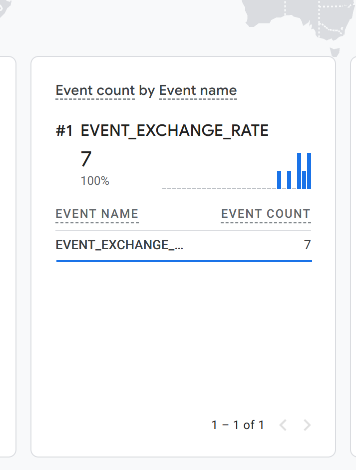
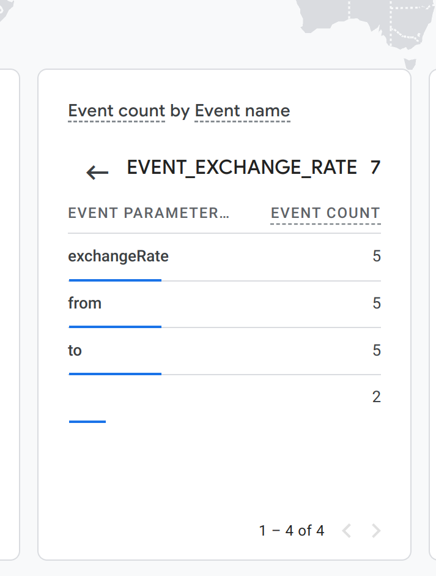
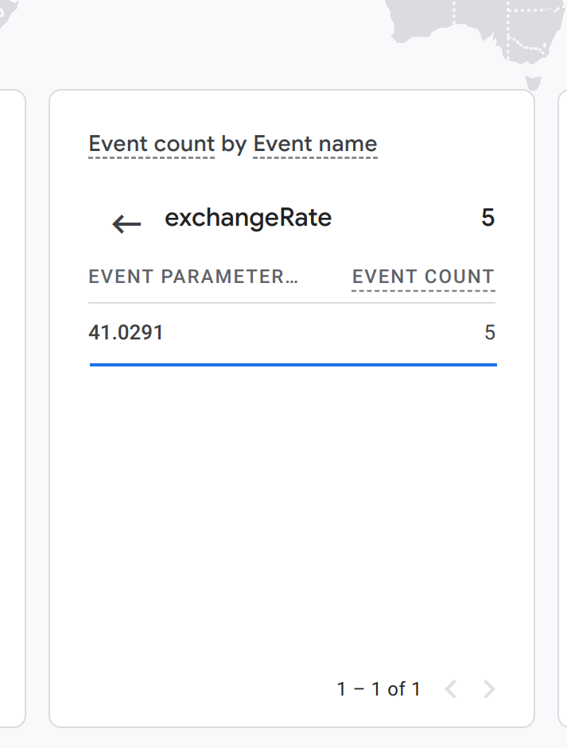
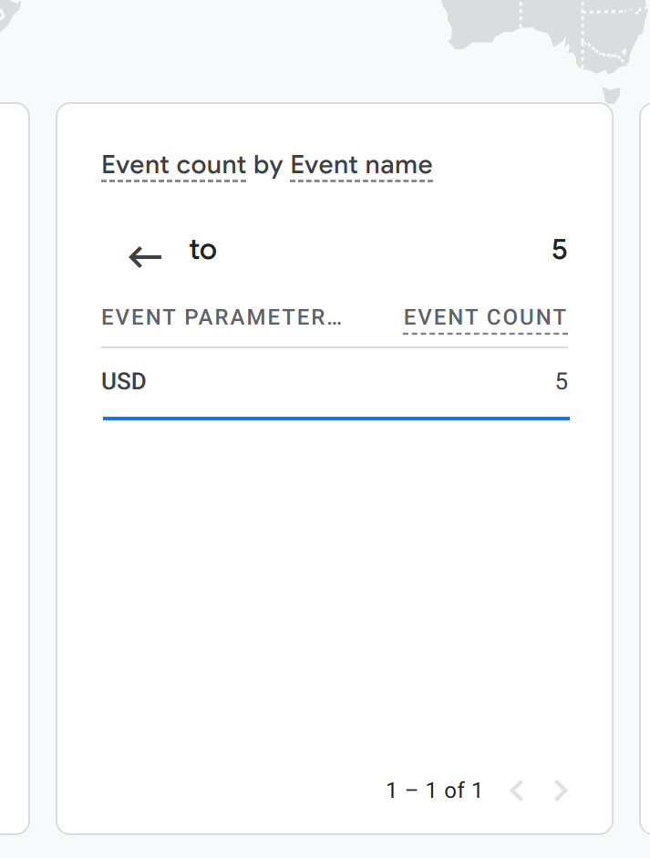

# projector-google-analytics

## To run the script
1. Copy `.env.example` to `.env` with your params
2. `node index.js`

## Results
```
Worker started. Pushing info to Google Analytics 4 every  10000  ms
Sent:  41.0291  for FROM:  UAH  to TO:  USD
Sent:  41.0291  for FROM:  UAH  to TO:  USD
Sent:  41.0291  for FROM:  UAH  to TO:  USD
Sent:  41.0291  for FROM:  UAH  to TO:  USD
Sent:  41.0291  for FROM:  UAH  to TO:  USD
Sent:  41.0291  for FROM:  UAH  to TO:  USD
Sent:  41.0291  for FROM:  UAH  to TO:  USD
...
```
#### Events

#### Params

#### Exchange Rate

#### To
